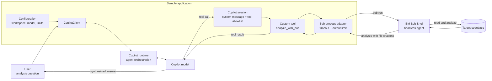
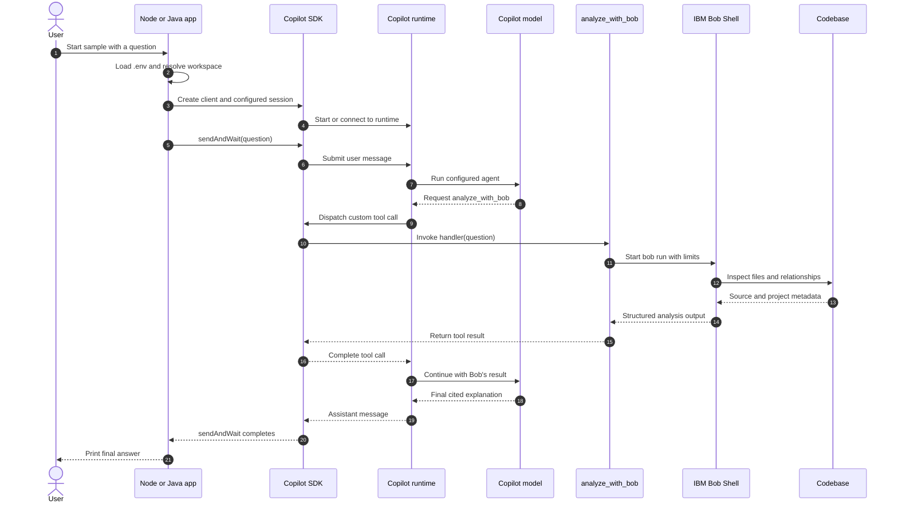
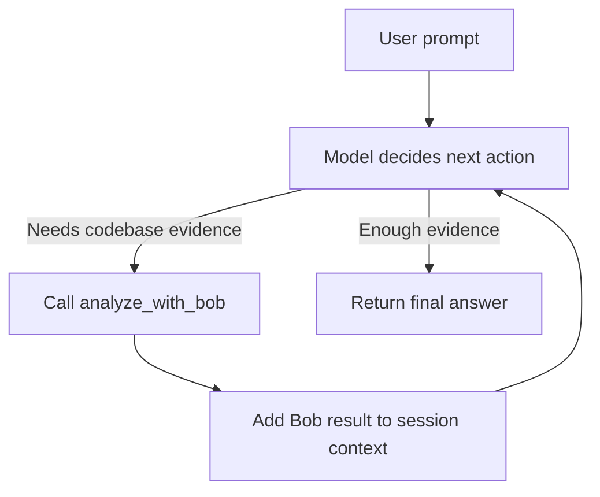
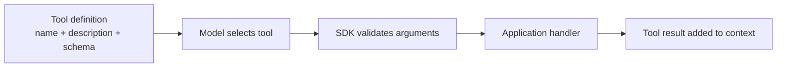
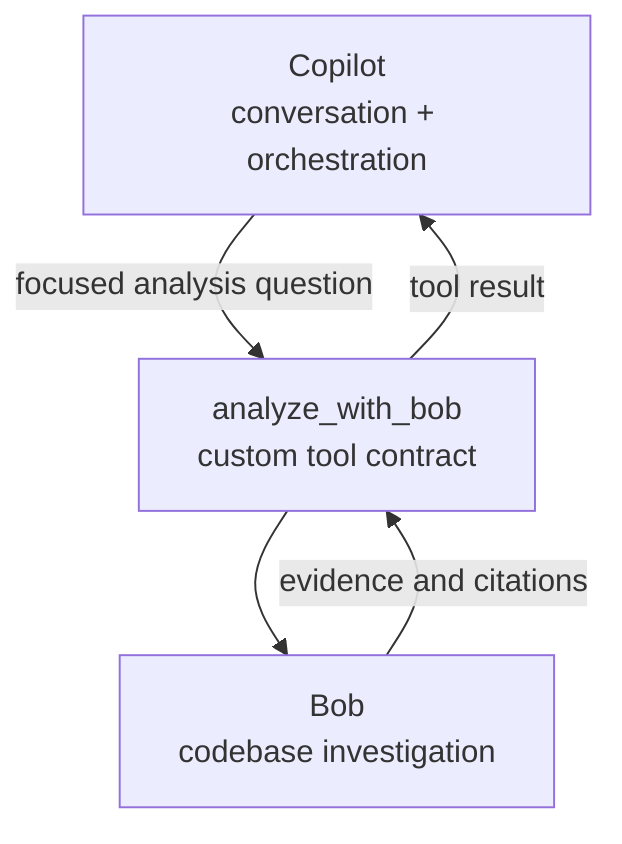
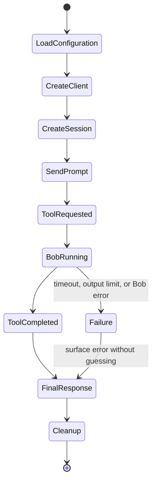

# Copilot SDK agents with IBM Bob Shell

This repository contains equivalent GitHub Copilot SDK samples that expose IBM
Bob Shell as a custom codebase-analysis tool.

## Conceptual architecture

The sample combines two agentic systems with a narrow integration boundary:
Copilot owns the conversation and orchestration, while Bob owns codebase
inspection. The application connects them through a single custom tool.

The custom tool is intentionally the only codebase-analysis capability exposed
to the model. Copilot cannot inspect the workspace directly in these samples;
it must ask Bob and base its final answer on Bob's result.

## Request flow

## Copilot SDK concepts demonstrated

| Concept | Role in this sample | Node.js | Java |
|---|---|---|---|
| **Client** | Owns the connection to the Copilot runtime and its lifecycle. | `CopilotClient` | `CopilotClient` |
| **Runtime** | Executes the agent loop, sends prompts to the model, and dispatches tool calls back to the application. | Bundled Copilot runtime | Installed Copilot CLI |
| **Session** | Holds one conversation plus its model, instructions, tools, workspace, and permissions. | `createSession(...)` | `createSession(SessionConfig)` |
| **System message** | Replaces the default instructions so the model must call Bob before answering codebase questions. | `systemMessage.mode: "replace"` | `SystemMessageMode.REPLACE` |
| **Custom tool** | Defines an application-owned capability that the model may invoke. | `defineTool(...)` | `ToolDefinition.create(...)` |
| **Tool schema** | Describes and validates the `question` argument the model supplies to the tool. | Zod object schema | JSON Schema map |
| **Tool handler** | Runs application code when Copilot selects the tool. Here it starts Bob and returns Bob's analysis. | Async handler function | `CompletableFuture` handler |
| **Tool allowlist** | Restricts the session to `analyze_with_bob`, reducing accidental access to unrelated tools. | `ToolSet.addCustom(...)` | `setAvailableTools(...)` |
| **Permissions** | Controls whether an approved tool call may execute. | Tool uses `skipPermission` | Session uses `PermissionHandler.APPROVE_ALL` |
| **Working directory** | Establishes the codebase context shared by the session and Bob invocation. | `workingDirectory` | `setWorkingDirectory(...)` |
| **Events** | Expose session activity such as tool execution for logging or UI updates. | `tool.execution_start` listener | Event APIs are available but not needed by the sample |
| **Send and wait** | Submits the user prompt and waits until the agent finishes its tool loop and final response. | `sendAndWait(...)` | `sendAndWait(...)` |
| **Lifecycle cleanup** | Releases the session, runtime connection, processes, and executors. | `disconnect()` and `client.stop()` | try-with-resources |

### Client, runtime, and session

The SDK client is not the model itself. It communicates with the Copilot
runtime, which implements the agent loop:

A session is the unit that combines the model selection, system message,
available tools, workspace, permissions, and conversation history. The model
may call the custom tool and continue reasoning multiple times before the
session becomes idle and `sendAndWait` returns.

### Custom tools

Custom tools are typed callbacks from the Copilot runtime into application
code. Each definition contains:

1. A stable tool name: `analyze_with_bob`.
2. A description that tells the model when the tool is useful.
3. A parameter schema with one required `question` string.
4. A handler that receives the validated arguments and returns Bob's output.

The SDK does not know how IBM Bob works. It only knows the tool contract.
Everything behind that contract—starting Bob, passing credentials, enforcing
limits, and interpreting process failures—is owned by the sample application.

### System instructions and tool restrictions

The system message tells the model to:

- call Bob before answering;
- use only Bob's findings;
- preserve Bob's file-path citations;
- report failures rather than inventing an answer.

The tool allowlist reinforces those instructions at the runtime level. The
Node.js client additionally uses `mode: "empty"`, which opts out of the normal
Copilot CLI defaults before explicitly enabling the custom tool. The Java
sample uses an explicit session allowlist for the same effective tool boundary.

### Bob as a nested agent

Bob is invoked as a headless subprocess, not as an SDK-native tool or MCP
server. Conceptually, this is an agent calling another specialized agent:

The adapter starts `bob run` directly without a command shell. It passes the
API key through the subprocess environment and applies a turn limit, timeout,
and output-size limit. Bob is also instructed to operate read-only.

## Implementation lifecycle

| Language | Directory | Runtime |
|---|---|---|
| Node.js / TypeScript | [`nodejs/`](nodejs/) | Node.js 26 |
| Java | [`java/`](java/) | Java 26 and Maven 3.9+ |

Each sample:

- exposes only an `analyze_with_bob` custom tool to the Copilot session;
- runs `bob` directly without a shell;
- asks Bob to inspect the selected workspace in read-only mode;
- bounds Bob's turns, runtime, and captured output;
- loads `BOB_API_KEY` from a git-ignored local `.env` file.

See each language directory for setup and usage instructions.
